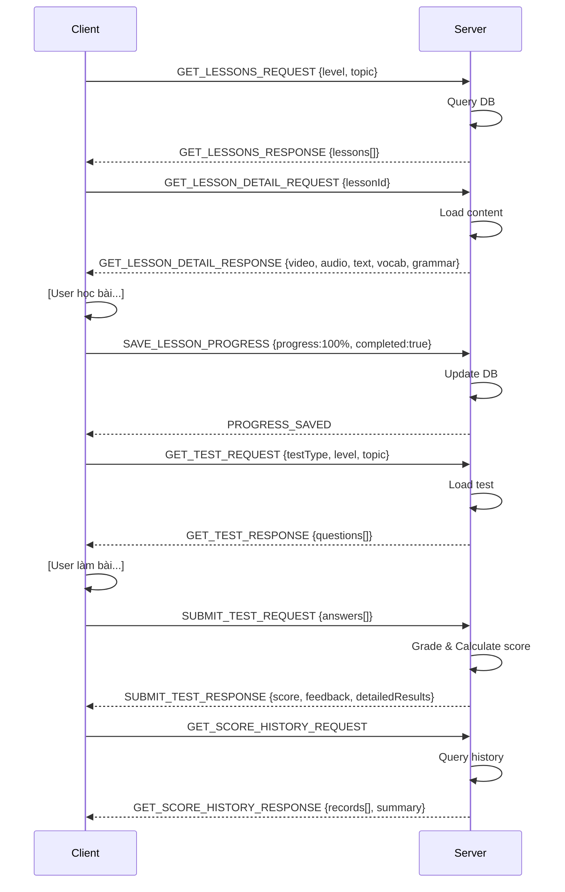
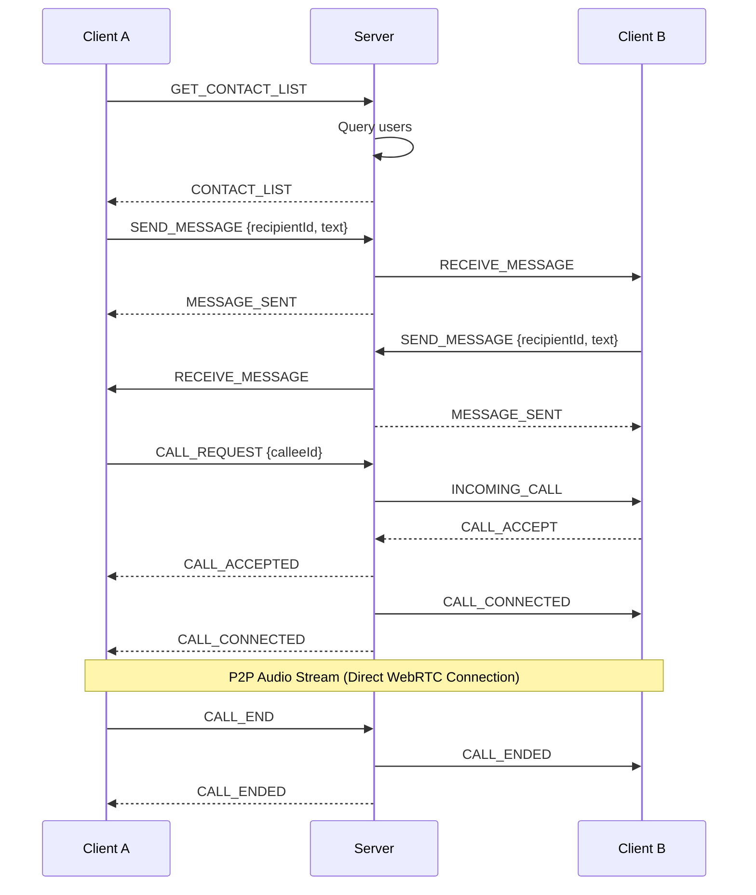
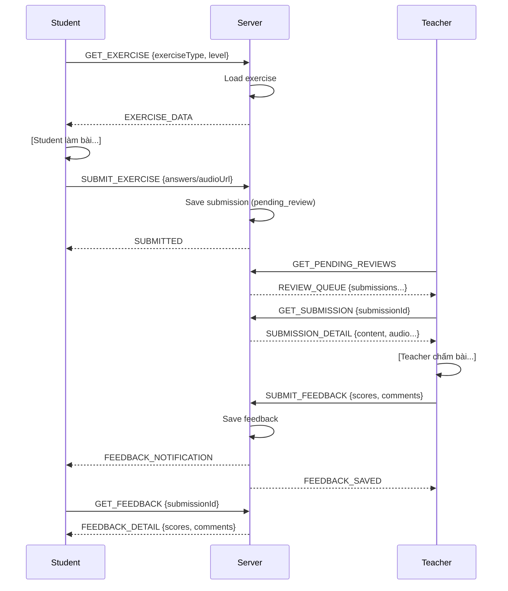

# THIẾT KẾ BẢN TIN GIAO THỨC TẦNG ỨNG DỤNG
## Luồng học bài


## Luồng chat & voice call


## Luồng làm bài tập & nhận feedback


## 1. ĐĂNG KÝ VÀ ĐĂNG NHẬP
### 1.1. REGISTER_REQUEST
Mô tả: Client gửi yêu cầu đăng ký tài khoản mới.

```
{
  "messageType": "REGISTER_REQUEST",
  "messageId": "msg_101",
  "timestamp": 1698765400000,
  "payload": {
    "fullname": "Nguyen Van A",
    "email": "user@example.com",
    "password": "12345678",
    "confirmPassword": "12345678"
  }
}
```

### 1.2. REGISTER_RESPONSE
Mô tả: Server phản hồi kết quả đăng ký.
```
{
  "messageType": "REGISTER_RESPONSE",
  "messageId": "msg_101",
  "timestamp": 1698765401000,
  "payload": {
    "status": "success | error",
    "message": "Register successfully",
    "data": {
      "userId": "user_001",
      "fullname": "Nguyen Van A",
      "email": "user@example.com",
      "createdAt": 1698765401000
    }
  }
}

```
Trường hợp lỗi:
```
{
  "messageType": "REGISTER_RESPONSE",
  "messageId": "msg_101",
  "timestamp": 1698765401000,
  "payload": {
    "status": "error",
    "message": "Email already exists"
  }
}
```

### 1.3. LOGIN_REQUEST
Mô tả: Client gửi yêu cầu đăng nhập.
```
{
  "messageType": "LOGIN_REQUEST",
  "messageId": "msg_102",
  "timestamp": 1698765410000,
  "payload": {
    "email": "user@example.com",
    "password": "12345678"
  }
}
```

### 1.4. LOGIN_RESPONSE
Mô tả: Server trả về thông tin đăng nhập và session token (JWT).
```
{
  "messageType": "LOGIN_RESPONSE",
  "messageId": "msg_102",
  "timestamp": 1698765411000,
  "payload": {
    "status": "success | error",
    "message": "Login successfully",
    "data": {
      "userId": "user_001",
      "fullname": "Nguyen Van A",
      "email": "user@example.com",
      "sessionToken": "eyJhbGciOiJIUzI1NiIsInR5cCI6IkpXVCJ9...",
      "expiresAt": 1698769011000
    }
  }
}

```
Trường hợp lỗi (ví dụ sai mật khẩu):
```
{
  "messageType": "LOGIN_RESPONSE",
  "messageId": "msg_102",
  "timestamp": 1698765411000,
  "payload": {
    "status": "error",
    "message": "Invalid email or password"
  }
}

```

## 2. XEM DANH SÁCH BÀI HỌC THEO CHỦ ĐỀ VÀ MỨC ĐỘ
### 2.1. GET_LESSONS_REQUEST
Mô tả: Client yêu cầu danh sách bài học theo bộ lọc
```
{
  "messageType": "GET_LESSONS_REQUEST",
  "messageId": "msg_001",
  "timestamp": 1698765436000,
  "sessionToken": "eyJhbGciOiJIUzI1NiIsInR5cCI6IkpXVCJ9...",
  "payload": {
    "level": "beginner|intermediate|advanced",
    "topic": "grammar|vocabulary|listening|speaking|reading|writing",
    "page": 1,
    "limit": 20
  }
}
```
### 2.2. GET_LESSONS_RESPONSE
Mô tả: Server trả về danh sách bài học
```
{
  "messageType": "GET_LESSONS_RESPONSE",
  "messageId": "msg_001",
  "timestamp": 1698765437000,
  "payload": {
    "status": "success|error",
    "message": "Retrieved lessons successfully",
    "data": {
      "lessons": [
        {
          "lessonId": "lesson_001",
          "title": "Present Simple Tense",
          "description": "Learn how to use present simple tense",
          "topic": "grammar",
          "level": "beginner",
          "duration": 30,
          "thumbnailUrl": "http://server.com/thumbnails/lesson_001.jpg",
          "completionStatus": false,
          "progress": 0,
          "rating": 4.5,
          "totalStudents": 1250
        },
        {
          "lessonId": "lesson_002",
          "title": "Common Daily Vocabulary",
          "description": "Essential vocabulary for daily conversation",
          "topic": "vocabulary",
          "level": "beginner",
          "duration": 25,
          "thumbnailUrl": "http://server.com/thumbnails/lesson_002.jpg",
          "completionStatus": true,
          "progress": 100,
          "rating": 4.7,
          "totalStudents": 2100
        }
      ],
      "pagination": {
        "currentPage": 1,
        "totalPages": 5,
        "totalLessons": 98,
        "limit": 20
      }
    }
  }
}
```

## 3. HỌC BÀI HỌC
### 3.1. GET_LESSON_DETAIL_REQUEST
Mô tả: Lấy chi tiết một bài học cụ thể
```
{
  "messageType": "GET_LESSON_DETAIL_REQUEST",
  "messageId": "msg_002",
  "timestamp": 1698765438000,
  "sessionToken": "eyJhbGciOiJIUzI1NiIsInR5cCI6IkpXVCJ9...",
  "payload": {
    "lessonId": "lesson_001"
  }
}
```
### 3.2. GET_LESSON_DETAIL_RESPONSE
Mô tả: Server trả về nội dung đầy đủ của bài học
```
{
  "messageType": "GET_LESSON_DETAIL_RESPONSE",
  "messageId": "msg_002",
  "timestamp": 1698765439000,
  "payload": {
    "status": "success",
    "data": {
      "lessonId": "lesson_001",
      "title": "Present Simple Tense",
      "description": "Learn how to use present simple tense",
      "level": "beginner",
      "topic": "grammar",
      "duration": 30,
      
      "videoContent": {
        "videoUrl": "http://media.server.com/videos/lesson_001.mp4",
        "duration": 600,
        "subtitleUrl": "http://media.server.com/subtitles/lesson_001_en.vtt",
        "thumbnailUrl": "http://media.server.com/thumbnails/lesson_001.jpg"
      },
      
      "audioContent": {
        "audioUrl": "http://media.server.com/audios/lesson_001.mp3",
        "duration": 450,
        "transcriptUrl": "http://media.server.com/transcripts/lesson_001.txt"
      },
      
      "textContent": {
        "introduction": "The present simple tense is used to describe habits, unchanging situations, general truths, and fixed arrangements.",
        "mainContent": "## Usage\n1. Habits and routines\n2. General truths\n3. Fixed schedules...",
        "summary": "Present simple is formed with base verb (+ s/es for third person singular)"
      },
      
      "vocabulary": [
        {
          "word": "study",
          "pronunciation": "/ˈstʌdi/",
          "partOfSpeech": "verb",
          "meaning": "học",
          "example": "I study English every day",
          "audioUrl": "http://media.server.com/vocab/study.mp3"
        },
        {
          "word": "always",
          "pronunciation": "/ˈɔːlweɪz/",
          "partOfSpeech": "adverb",
          "meaning": "luôn luôn",
          "example": "She always arrives on time",
          "audioUrl": "http://media.server.com/vocab/always.mp3"
        }
      ],
      
      "grammar": {
        "title": "Present Simple Tense Structure",
        "rules": [
          {
            "type": "Affirmative",
            "structure": "Subject + base verb (+ s/es for 3rd person)",
            "examples": [
              "I work in an office",
              "He works in an office"
            ]
          },
          {
            "type": "Negative",
            "structure": "Subject + do/does + not + base verb",
            "examples": [
              "I don't work on Sundays",
              "She doesn't work on Sundays"
            ]
          },
          {
            "type": "Question",
            "structure": "Do/Does + subject + base verb?",
            "examples": [
              "Do you work here?",
              "Does he work here?"
            ]
          }
        ],
        "notes": "Remember to add -s or -es for third person singular (he, she, it)"
      },
      
      "relatedLessons": [
        {
          "lessonId": "lesson_005",
          "title": "Present Continuous Tense"
        }
      ]
    }
  }
}
```

### 3.3. SAVE_LESSON_PROGRESS_REQUEST
Mô tả: Lưu tiến độ học bài
```
{
  "messageType": "SAVE_LESSON_PROGRESS_REQUEST",
  "messageId": "msg_003",
  "timestamp": 1698765440000,
  "sessionToken": "eyJhbGciOiJIUzI1NiIsInR5cCI6IkpXVCJ9...",
  "payload": {
    "lessonId": "lesson_001",
    "progress": 75,
    "currentSection": "grammar",
    "timeSpent": 1200,
    "completed": false
  }
}

### 3.4. SAVE_LESSON_PROGRESS_RESPONSE
{
  "messageType": "SAVE_LESSON_PROGRESS_RESPONSE",
  "messageId": "msg_003",
  "timestamp": 1698765441000,
  "payload": {
    "status": "success",
    "message": "Progress saved successfully",
    "data": {
      "lessonId": "lesson_001",
      "progress": 75,
      "lastAccessed": 1698765440000
    }
  }
}
```

## 4. LÀM BÀI KIỂM TRA
### 4.1. GET_TEST_REQUEST
Mô tả: Lấy đề kiểm tra theo loại
```
{
  "messageType": "GET_TEST_REQUEST",
  "messageId": "msg_004",
  "timestamp": 1698765442000,
  "sessionToken": "eyJhbGciOiJIUzI1NiIsInR5cCI6IkpXVCJ9...",
  "payload": {
    "testType": "multiple_choice|fill_blank|sentence_order",
    "level": "beginner|intermediate|advanced",
    "topic": "grammar|vocabulary|listening|reading"
  }
}
```
### 4.2. GET_TEST_RESPONSE
Mô tả: Server trả về đề thi
```
{
  "messageType": "GET_TEST_RESPONSE",
  "messageId": "msg_004",
  "timestamp": 1698765443000,
  "payload": {
    "status": "success",
    "data": {
      "testId": "test_001",
      "testType": "mixed",
      "level": "intermediate",
      "topic": "grammar",
      "title": "Present Tenses Test",
      "duration": 1800,
      "totalQuestions": 15,
      "passingScore": 70,
      
      "questions": [
        {
          "questionId": "q_001",
          "type": "multiple_choice",
          "order": 1,
          "question": "What is the past tense of 'go'?",
          "options": [
            {"id": "a", "text": "goed"},
            {"id": "b", "text": "went"},
            {"id": "c", "text": "gone"},
            {"id": "d", "text": "going"}
          ],
          "points": 10
        },
        {
          "questionId": "q_002",
          "type": "fill_blank",
          "order": 2,
          "question": "I ____ to school every day.",
          "blanks": ["go"],
          "hint": "present simple tense",
          "points": 10
        },
        {
          "questionId": "q_003",
          "type": "sentence_order",
          "order": 3,
          "instruction": "Arrange the words to make a correct sentence",
          "words": ["always", "She", "early", "arrives"],
          "points": 15
        },
        {
          "questionId": "q_004",
          "type": "multiple_choice",
          "order": 4,
          "question": "Choose the correct sentence:",
          "options": [
            {"id": "a", "text": "He don't like coffee"},
            {"id": "b", "text": "He doesn't likes coffee"},
            {"id": "c", "text": "He doesn't like coffee"},
            {"id": "d", "text": "He not like coffee"}
          ],
          "points": 10
        }
      ],
      
      "instructions": "Read each question carefully. You have 30 minutes to complete this test."
    }
  }
}
```
### 4.3. SUBMIT_TEST_REQUEST
Mô tả: Nộp bài kiểm tra
```
{
  "messageType": "SUBMIT_TEST_REQUEST",
  "messageId": "msg_005",
  "timestamp": 1698765444000,
  "sessionToken": "eyJhbGciOiJIUzI1NiIsInR5cCI6IkpXVCJ9...",
  "payload": {
    "testId": "test_001",
    "timeSpent": 1560,
    "answers": [
      {
        "questionId": "q_001",
        "answer": "b"
      },
      {
        "questionId": "q_002",
        "answer": "go"
      },
      {
        "questionId": "q_003",
        "answer": ["She", "always", "arrives", "early"]
      },
      {
        "questionId": "q_004",
        "answer": "c"
      }
    ]
  }
}
```
### 4.4. SUBMIT_TEST_RESPONSE
Mô tả: Kết quả chấm điểm tự động
```
{
  "messageType": "SUBMIT_TEST_RESPONSE",
  "messageId": "msg_005",
  "timestamp": 1698765445000,
  "payload": {
    "status": "success",
    "data": {
      "testId": "test_001",
      "submissionId": "sub_12345",
      "score": 85,
      "percentage": 85,
      "totalPoints": 100,
      "earnedPoints": 85,
      "totalQuestions": 15,
      "correctAnswers": 12,
      "wrongAnswers": 3,
      "passed": true,
      "grade": "B",
      "timeSpent": 1560,
      "submittedAt": 1698765444000,
      
      "detailedResults": [
        {
          "questionId": "q_001",
          "correct": true,
          "userAnswer": "b",
          "correctAnswer": "b",
          "points": 10,
          "earnedPoints": 10,
          "explanation": "'Went' is the correct past tense of 'go'"
        },
        {
          "questionId": "q_002",
          "correct": true,
          "userAnswer": "go",
          "correctAnswer": "go",
          "points": 10,
          "earnedPoints": 10,
          "explanation": "Present simple tense uses base form for 'I'"
        },
        {
          "questionId": "q_003",
          "correct": true,
          "userAnswer": ["She", "always", "arrives", "early"],
          "correctAnswer": ["She", "always", "arrives", "early"],
          "points": 15,
          "earnedPoints": 15,
          "explanation": "Correct word order: Subject + Adverb + Verb + Adverb"
        },
        {
          "questionId": "q_004",
          "correct": true,
          "userAnswer": "c",
          "correctAnswer": "c",
          "points": 10,
          "earnedPoints": 10,
          "explanation": "Use 'doesn't + base verb' for negative in present simple"
        }
      ],
      
      "statistics": {
        "averageScore": 78,
        "yourRanking": "Top 15%",
        "totalAttempts": 3245
      }
    }
  }
}
```

## 5. LÀM BÀI TẬP
### 5.1. GET_EXERCISE_REQUEST
Mô tả: Lấy bài tập theo loại
```
{
  "messageType": "GET_EXERCISE_REQUEST",
  "messageId": "msg_006",
  "timestamp": 1698765446000,
  "sessionToken": "eyJhbGciOiJIUzI1NiIsInR5cCI6IkpXVCJ9...",
  "payload": {
    "exerciseType": "sentence_rewrite|paragraph_writing|topic_speaking",
    "level": "beginner|intermediate|advanced",
    "topic": "grammar|vocabulary|writing|speaking"
  }
}
```
### 5.2. GET_EXERCISE_RESPONSE
```
{
  "messageType": "GET_EXERCISE_RESPONSE",
  "messageId": "msg_006",
  "timestamp": 1698765447000,
  "payload": {
    "status": "success",
    "data": {
      "exerciseId": "ex_001",
      "exerciseType": "sentence_rewrite",
      "level": "intermediate",
      "topic": "grammar",
      "title": "Rewrite Sentences in Passive Voice",
      "instructions": "Rewrite the following sentences in passive voice",
      "timeLimit": 1200,
      "totalPoints": 50,
      
      "questions": [
        {
          "questionId": "eq_001",
          "sentence": "The chef prepares the meals",
          "hint": "Focus on the object 'meals'",
          "points": 10
        },
        {
          "questionId": "eq_002",
          "sentence": "People speak English all over the world",
          "hint": "Change the subject to 'English'",
          "points": 10
        }
      ]
    }
  }
}
```
### 5.3. GET_PARAGRAPH_EXERCISE_RESPONSE
```
{
  "messageType": "GET_EXERCISE_RESPONSE",
  "messageId": "msg_007",
  "timestamp": 1698765448000,
  "payload": {
    "status": "success",
    "data": {
      "exerciseId": "ex_002",
      "exerciseType": "paragraph_writing",
      "level": "intermediate",
      "topic": "writing",
      "title": "Write about Your Daily Routine",
      "instructions": "Write a paragraph (150-200 words) describing your daily routine",
      "timeLimit": 2400,
      "totalPoints": 100,
      
      "prompt": "Describe a typical day in your life. Include what time you wake up, what you do during the day, and what time you go to bed.",
      
      "requirements": [
        "Minimum 150 words",
        "Use present simple tense",
        "Include time expressions",
        "Proper paragraph structure"
      ],
      
      "rubric": {
        "content": 40,
        "grammar": 30,
        "vocabulary": 20,
        "organization": 10
      }
    }
  }
}
```
### 5.4. GET_SPEAKING_EXERCISE_RESPONSE
```
{
  "messageType": "GET_EXERCISE_RESPONSE",
  "messageId": "msg_008",
  "timestamp": 1698765449000,
  "payload": {
    "status": "success",
    "data": {
      "exerciseId": "ex_003",
      "exerciseType": "topic_speaking",
      "level": "advanced",
      "topic": "speaking",
      "title": "Speak about Environmental Issues",
      "instructions": "Record yourself speaking about the given topic for 2-3 minutes",
      "timeLimit": 180,
      "totalPoints": 100,
      
      "topic": "Environmental Issues",
      "prompt": "Discuss the most pressing environmental issues in your country and suggest possible solutions.",
      
      "questions": [
        "What are the main environmental problems?",
        "How do these issues affect daily life?",
        "What can individuals do to help?",
        "What should the government do?"
      ],
      
      "rubric": {
        "pronunciation": 25,
        "fluency": 25,
        "vocabulary": 25,
        "grammar": 15,
        "content": 10
      }
    }
  }
}
```
## 5.5. SUBMIT_EXERCISE_REQUEST
Mô tả: Nộp bài tập (văn bản)
```
{
  "messageType": "SUBMIT_EXERCISE_REQUEST",
  "messageId": "msg_009",
  "timestamp": 1698765450000,
  "sessionToken": "eyJhbGciOiJIUzI1NiIsInR5cCI6IkpXVCJ9...",
  "payload": {
    "exerciseId": "ex_001",
    "exerciseType": "sentence_rewrite",
    "timeSpent": 780,
    "answers": [
      {
        "questionId": "eq_001",
        "answer": "The meals are prepared by the chef"
      },
      {
        "questionId": "eq_002",
        "answer": "English is spoken all over the world"
      }
    ]
  }
}
```
### 5.6. SUBMIT_PARAGRAPH_REQUEST
Mô tả: Nộp bài viết đoạn văn
```
{
  "messageType": "SUBMIT_EXERCISE_REQUEST",
  "messageId": "msg_010",
  "timestamp": 1698765451000,
  "sessionToken": "eyJhbGciOiJIUzI1NiIsInR5cCI6IkpXVCJ9...",
  "payload": {
    "exerciseId": "ex_002",
    "exerciseType": "paragraph_writing",
    "timeSpent": 1800,
    "content": "I usually wake up at 6:30 AM every day. After getting up, I brush my teeth and take a shower. Then I have breakfast with my family at 7:00 AM. I usually eat bread, eggs, and drink a cup of coffee. At 7:30 AM, I leave home and go to work. I work from 8:00 AM to 5:00 PM with a one-hour lunch break at noon. After work, I go to the gym for an hour. I return home at around 7:00 PM and have dinner with my family. In the evening, I spend time watching TV or reading books. Finally, I go to bed at 11:00 PM.",
    "wordCount": 132
  }
}
```
### 5.7. SUBMIT_SPEAKING_REQUEST
Mô tả: Nộp bài nói (audio file)
```
{
  "messageType": "SUBMIT_EXERCISE_REQUEST",
  "messageId": "msg_011",
  "timestamp": 1698765452000,
  "sessionToken": "eyJhbGciOiJIUzI1NiIsInR5cCI6IkpXVCJ9...",
  "payload": {
    "exerciseId": "ex_003",
    "exerciseType": "topic_speaking",
    "timeSpent": 165,
    "audioUrl": "http://upload.server.com/recordings/user_123_ex_003.mp3",
    "duration": 150,
    "fileSize": 2456789
  }
}
```
### 5.8. SUBMIT_EXERCISE_RESPONSE
Mô tả: Phản hồi sau khi nộp bài (cần review từ giáo viên)
```{
  "messageType": "SUBMIT_EXERCISE_RESPONSE",
  "messageId": "msg_011",
  "timestamp": 1698765453000,
  "payload": {
    "status": "success",
    "data": {
      "submissionId": "sub_67890",
      "exerciseId": "ex_003",
      "submittedAt": 1698765452000,
      "status": "pending_review",
      "autoScore": null,
      "message": "Your submission has been received and is pending teacher review",
      "estimatedReviewTime": "24-48 hours",
      "reviewStatus": {
        "stage": "queued",
        "position": 5,
        "assignedTeacher": "teacher_456"
      }
    }
  }
}
```

## 6. CHƠI TRÒ CHƠI
### 6.1. GET_GAME_LIST_REQUEST
Mô tả: Lấy danh sách trò chơi có sẵn
```{
  "messageType": "GET_GAME_LIST_REQUEST",
  "messageId": "msg_012",
  "timestamp": 1698765454000,
  "sessionToken": "eyJhbGciOiJIUzI1NiIsInR5cCI6IkpXVCJ9...",
  "payload": {
    "gameType": "word_match|sentence_match|picture_match|all",
    "level": "beginner|intermediate|advanced"
  }
}
```
### 6.2. GET_GAME_LIST_RESPONSE
```{
  "messageType": "GET_GAME_LIST_RESPONSE",
  "messageId": "msg_012",
  "timestamp": 1698765455000,
  "payload": {
    "status": "success",
    "data": {
      "games": [
        {
          "gameId": "game_001",
          "gameType": "word_match",
          "title": "Daily Vocabulary Matching",
          "level": "beginner",
          "description": "Match English words with their Vietnamese meanings",
          "thumbnailUrl": "http://server.com/game_thumbs/game_001.jpg",
          "totalPairs": 10,
          "timeLimit": 300,
          "highScore": 850,
          "yourBestScore": 720,
          "totalPlays": 1250
        },
        {
          "gameId": "game_002",
          "gameType": "sentence_match",
          "title": "Complete the Conversation",
          "level": "intermediate",
          "description": "Match questions with appropriate responses",
          "thumbnailUrl": "http://server.com/game_thumbs/game_002.jpg",
          "totalPairs": 8,
          "timeLimit": 240,
          "highScore": 950,
          "yourBestScore": 0,
          "totalPlays": 850
        }
      ]
    }
  }
}
```
### 6.3. START_GAME_REQUEST
Mô tả: Bắt đầu một game cụ thể
```{
  "messageType": "START_GAME_REQUEST",
  "messageId": "msg_013",
  "timestamp": 1698765456000,
  "sessionToken": "eyJhbGciOiJIUzI1NiIsInR5cCI6IkpXVCJ9...",
  "payload": {
    "gameId": "game_001"
  }
}
```
### 6.4. START_GAME_RESPONSE - Word Match
```{
  "messageType": "START_GAME_RESPONSE",
  "messageId": "msg_013",
  "timestamp": 1698765457000,
  "payload": {
    "status": "success",
    "data": {
      "gameSessionId": "gs_12345",
      "gameId": "game_001",
      "gameType": "word_match",
      "level": "beginner",
      "timeLimit": 300,
      "startTime": 1698765457000,
      
      "items": [
        {
          "id": "item_1",
          "type": "word",
          "content": "Hello",
          "audioUrl": "http://server.com/audio/hello.mp3"
        },
        {
          "id": "item_2",
          "type": "meaning",
          "content": "Xin chào"
        },
        {
          "id": "item_3",
          "type": "word",
          "content": "Goodbye",
          "audioUrl": "http://server.com/audio/goodbye.mp3"
        },
        {
          "id": "item_4",
          "type": "meaning",
          "content": "Tạm biệt"
        },
        {
          "id": "item_5",
          "type": "word",
          "content": "Thank you",
          "audioUrl": "http://server.com/audio/thankyou.mp3"
        },
        {
          "id": "item_6",
          "type": "meaning",
          "content": "Cảm ơn"
        }
      ],
      
      "correctPairs": [
        ["item_1", "item_2"],
        ["item_3", "item_4"],
        ["item_5", "item_6"]
      ],
      
      "scoring": {
        "correctMatch": 100,
        "wrongMatch": -20,
        "timeBonus": 2
      }
    }
  }
}
```
### 6.5. START_GAME_RESPONSE - Sentence Match
```{
  "messageType": "START_GAME_RESPONSE",
  "messageId": "msg_014",
  "timestamp": 1698765458000,
  "payload": {
    "status": "success",
    "data": {
      "gameSessionId": "gs_12346",
      "gameId": "game_002",
      "gameType": "sentence_match",
      "level": "intermediate",
      "timeLimit": 240,
      "startTime": 1698765458000,
      
      "items": [
        {
          "id": "sent_1",
          "type": "question",
          "content": "How are you today?"
        },
        {
          "id": "sent_2",
          "type": "answer",
          "content": "I'm fine, thank you!"
        },
        {
          "id": "sent_3",
          "type": "question",
          "content": "What's your name?"
        },
        {
          "id": "sent_4",
          "type": "answer",
          "content": "My name is John."
        },
        {
          "id": "sent_5",
          "type": "question",
          "content": "Where are you from?"
        },
        {
          "id": "sent_6",
          "type": "answer",
          "content": "I'm from Vietnam."
        }
      ],
      
      "correctPairs": [
        ["sent_1", "sent_2"],
        ["sent_3", "sent_4"],
        ["sent_5", "sent_6"]
      ],
      
      "scoring": {
        "correctMatch": 120,
        "wrongMatch": -25,
        "timeBonus": 3
      }
    }
  }
}
```
### 6.6. START_GAME_RESPONSE - Picture Match
```{
  "messageType": "START_GAME_RESPONSE",
  "messageId": "msg_015",
  "timestamp": 1698765459000,
  "payload": {
    "status": "success",
    "data": {
      "gameSessionId": "gs_12347",
      "gameId": "game_003",
      "gameType": "picture_match",
      "level": "beginner",
      "timeLimit": 180,
      "startTime": 1698765459000,
      
      "items": [
        {
          "id": "pic_1",
          "type": "picture",
          "imageUrl": "http://server.com/images/apple.jpg",
          "altText": "apple"
        },
        {
          "id": "pic_2",
          "type": "word",
          "content": "Apple",
          "audioUrl": "http://server.com/audio/apple.mp3"
        },
        {
          "id": "pic_3",
          "type": "picture",
          "imageUrl": "http://server.com/images/cat.jpg",
          "altText": "cat"
        },
        {
          "id": "pic_4",
          "type": "word",
          "content": "Cat",
          "audioUrl": "http://server.com/audio/cat.mp3"
        }
      ],
      
      "correctPairs": [
        ["pic_1", "pic_2"],
        ["pic_3", "pic_4"]
      ],
      
      "scoring": {
        "correctMatch": 80,
        "wrongMatch": -15,
        "timeBonus": 2
      }
    }
  }
}
```
### 6.7. SUBMIT_GAME_RESULT_REQUEST
Mô tả: Gửi kết quả chơi game
```{
  "messageType": "SUBMIT_GAME_RESULT_REQUEST",
  "messageId": "msg_016",
  "timestamp": 1698765460000,
  "sessionToken": "eyJhbGciOiJIUzI1NiIsInR5cCI6IkpXVCJ9...",
  "payload": {
    "gameSessionId": "gs_12345",
    "gameId": "game_001",
    "completedAt": 1698765460000,
    "timeSpent": 245,
    "totalPairs": 10,
    "correctMatches": 9,
    "wrongMatches": 2,
    "score": 840,
    
    "matchHistory": [
      {
        "pair": ["item_1", "item_2"],
        "correct": true,
        "attemptTime": 15,
        "points": 100
      },
      {
        "pair": ["item_3", "item_6"],
        "correct": false,
        "attemptTime": 28,
        "points": -20
      },
      {
        "pair": ["item_3", "item_4"],
        "correct": true,
        "attemptTime": 35,
        "points": 100
      }
    ]
  }
}
```
### 6.8. SUBMIT_GAME_RESULT_RESPONSE
Mô tả: Phản hồi kết quả và xếp hạng
```{
  "messageType": "SUBMIT_GAME_RESULT_RESPONSE",
  "messageId": "msg_016",
  "timestamp": 1698765461000,
  "payload": {
    "status": "success",
    "data": {
      "gameSessionId": "gs_12345",
      "finalScore": 840,
      "timeBonus": 110,
      "totalScore": 950,
      "newHighScore": true,
      "previousBestScore": 720,
      "improvement": 230,
      
      "achievements": [
        {
          "achievementId": "ach_001",
          "title": "First Perfect Match",
          "description": "Complete a game with 100% accuracy",
          "iconUrl": "http://server.com/achievements/perfect.png",
          "earnedAt": 1698765461000
        }
      ],
      
      "ranking": {
        "globalRank": 156,
        "totalPlayers": 12450,
        "percentile": 98.7,
        "levelRank": 23,
        "levelPlayers": 3200
      },
      
      "leaderboard": [
        {
          "rank": 1,
          "username": "EnglishMaster",
          "score": 1000,
          "avatarUrl": "http://server.com/avatars/user_999.jpg"
        },
        {
          "rank": 2,
          "username": "WordWizard",
          "score": 985,
          "avatarUrl": "http://server.com/avatars/user_888.jpg"
        },
        {
          "rank": 156,
          "username": "You",
          "score": 950,
          "avatarUrl": "http://server.com/avatars/user_123.jpg",
          "highlight": true
        }
      ],
      
      "rewards": {
        "experiencePoints": 50,
        "coins": 25,
        "streak": 5,
        "nextLevelProgress": 75
      }
    }
  }
}
```

**7. NHẬN ĐIỂM VÀ PHẢN HỒI**

***7.1. GET_SCORE_HISTORY_REQUEST***
```
{
  "messageType": "GET_SCORE_HISTORY_REQUEST",
  "messageId": "msg_017",
  "timestamp": 1698765462000,
  "sessionToken": "eyJhbGciOiJIUzI1NiIsInR5cCI6IkpXVCJ9...",
  "payload": {
    "activityType": "test|exercise|game|all",
    "startDate": 1698000000000,
    "endDate": 1698765462000,
    "limit": 20,
    "page": 1
  }
}
```

***7.2. GET_SCORE_HISTORY_RESPONSE***
```
{
  "messageType": "GET_SCORE_HISTORY_RESPONSE",
  "messageId": "msg_017",
  "timestamp": 1698765463000,
  "payload": {
    "status": "success",
    "data": {
      "records": [
        {
          "recordId": "rec_001",
          "activityType": "test",
          "activityId": "test_001",
          "activityTitle": "Present Tenses Test",
          "submittedAt": 1698765445000,
          "score": 85,
          "maxScore": 100,
          "percentage": 85,
          "grade": "B",
          "passed": true,
          "feedback": "Good job! Focus more on irregular verbs.",
          "reviewedBy": "system"
        },
        {
          "recordId": "rec_002",
          "activityType": "exercise",
          "activityId": "ex_002",
          "activityTitle": "Write about Your Daily Routine",
          "submittedAt": 1698765451000,
          "score": 78,
          "maxScore": 100,
          "percentage": 78,
          "grade": "C+",
          "passed": true,
          "feedback": "Your content is good but pay attention to grammar and punctuation.",
          "reviewedBy": "teacher_456",
          "reviewedAt": 1698800000000,
          "detailedFeedback": {
            "content": 32,
            "grammar": 20,
            "vocabulary": 16,
            "organization": 10
          }
        },
        {
          "recordId": "rec_003",
          "activityType": "game",
          "activityId": "game_001",
          "activityTitle": "Daily Vocabulary Matching",
          "completedAt": 1698765461000,
          "score": 950,
          "maxScore": 1000,
          "percentage": 95,
          "rank": 156,
          "totalPlayers": 12450
        }
      ],
      
      "summary": {
        "totalActivities": 45,
        "averageScore": 82.5,
        "totalPoints": 3712,
        "highestScore": 98,
        "lowestScore": 65,
        "improvementRate": 12.5
      },
      
      "pagination": {
        "currentPage": 1,
        "totalPages": 3,
        "totalRecords": 45
      }
    }
  }
}
```

***7.3. GET_FEEDBACK_REQUEST***
```
{
  "messageType": "GET_FEEDBACK_REQUEST",
  "messageId": "msg_018",
  "timestamp": 1698765464000,
  "sessionToken": "eyJhbGciOiJIUzI1NiIsInR5cCI6IkpXVCJ9...",
  "payload": {
    "submissionId": "sub_67890",
    "activityType": "exercise"
  }
}
```

***7.3. GET_FEEDBACK_RESPONSE***
```
{
  "messageType": "GET_FEEDBACK_RESPONSE",
  "messageId": "msg_018",
  "timestamp": 1698765465000,
  "payload": {
    "status": "success",
    "data": {
      "submissionId": "sub_67890",
      "exerciseId": "ex_003",
      "exerciseTitle": "Speak about Environmental Issues",
      "submittedAt": 1698765452000,
      "reviewedAt": 1698820000000,
      "reviewStatus": "completed",
      
      "teacher": {
        "teacherId": "teacher_456",
        "name": "Ms. Sarah Johnson",
        "avatarUrl": "http://server.com/avatars/teacher_456.jpg"
      },
      
      "overallScore": 82,
      "maxScore": 100,
      "grade": "B",
      
      "detailedScores": {
        "pronunciation": {
          "score": 20,
          "maxScore": 25,
          "feedback": "Your pronunciation is clear. Work on the 'th' sound."
        },
        "fluency": {
          "score": 21,
          "maxScore": 25,
          "feedback": "Good fluency with minimal hesitation. Keep practicing!"
        },
        "vocabulary": {
          "score": 19,
          "maxScore": 25,
          "feedback": "Good range of vocabulary. Try to use more advanced terms."
        },
        "grammar": {
          "score": 13,
          "maxScore": 15,
          "feedback": "Minor grammar errors with conditional sentences."
        },
        "content": {
          "score": 9,
          "maxScore": 10,
          "feedback": "Excellent content and ideas!"
        }
      },
      
      "generalFeedback": "Well done! You presented your ideas clearly and covered all the required points. To improve, focus on using more complex sentence structures and advanced vocabulary. Pay special attention to the pronunciation of 'th' sounds in words like 'think' and 'through'. Overall, this is a strong performance!",
      
      "strengths": [
        "Clear and logical organization of ideas",
        "Good use of examples to support arguments",
        "Confident delivery"
      ],
      
      "areasForImprovement": [
        "Use more varied sentence structures",
        "Work on 'th' pronunciation",
        "Include more transitional phrases"
      ],
      
      "recommendations": [
        {
          "type": "lesson",
          "title": "Advanced Pronunciation Practice",
          "lessonId": "lesson_045"
        },
        {
          "type": "exercise",
          "title": "Complex Sentence Structures",
          "exerciseId": "ex_078"
        }
      ],
      
      "audioAnnotations": [
        {
          "timestamp": 45,
          "duration": 3,
          "comment": "Good pronunciation here!",
          "type": "positive"
        },
        {
          "timestamp": 87,
          "duration": 2,
          "comment": "Watch your 'th' sound: 'think' not 'tink'",
          "type": "correction"
        }
      ]
    }
  }
}
```

***7.5. FEEDBACK_NOTIFICATION***
```
{
  "messageType": "FEEDBACK_NOTIFICATION",
  "messageId": "msg_019",
  "timestamp": 1698820000000,
  "payload": {
    "notificationId": "notif_123",
    "type": "feedback_received",
    "submissionId": "sub_67890",
    "activityType": "exercise",
    "activityTitle": "Speak about Environmental Issues",
    "teacherName": "Ms. Sarah Johnson",
    "score": 82,
    "grade": "B",
    "message": "Your teacher has reviewed your submission",
    "actionUrl": "/feedback/sub_67890"
  }
}
```

**8. Chat với người dùng khác và giáo viên**
***8.1. GET_CONTACT_LIST_REQUEST***
```
{
  "messageType": "GET_CONTACT_LIST_REQUEST",
  "messageId": "msg_020",
  "timestamp": 1698765466000,
  "sessionToken": "eyJhbGciOiJIUzI1NiIsInR5cCI6IkpXVCJ9...",
  "payload": {
    "contactType": "teacher|student|all",
    "online": true
  }
}
```

***8.2. GET_CONTACT_LIST_RESPONSE***
```
{
  "messageType": "GET_CONTACT_LIST_RESPONSE",
  "messageId": "msg_020",
  "timestamp": 1698765467000,
  "payload": {
    "status": "success",
    "data": {
      "contacts": [
        {
          "userId": "teacher_456",
          "username": "sarah_johnson",
          "fullName": "Ms. Sarah Johnson",
          "role": "teacher",
          "avatarUrl": "http://server.com/avatars/teacher_456.jpg",
          "status": "online",
          "lastSeen": 1698765467000,
          "specialization": "Grammar & Speaking"
        },
        {
          "userId": "user_789",
          "username": "student02",
          "fullName": "Tran Thi B",
          "role": "student",
          "avatarUrl": "http://server.com/avatars/user_789.jpg",
          "status": "online",
          "lastSeen": 1698765400000,
          "level": "intermediate"
        },
        {
          "userId": "user_456",
          "username": "student03",
          "fullName": "Le Van C",
          "role": "student",
          "avatarUrl": "http://server.com/avatars/user_456.jpg",
          "status": "offline",
          "lastSeen": 1698750000000,
          "level": "beginner"
        }
      ],
      
      "onlineCount": 2,
      "totalContacts": 3
    }
  }
}
```

***8.3. SEND_MESSAGE_REQUEST***
```
{
  "messageType": "SEND_MESSAGE_REQUEST",
  "messageId": "msg_021",
  "timestamp": 1698765468000,
  "sessionToken": "eyJhbGciOiJIUzI1NiIsInR5cCI6IkpXVCJ9...",
  "payload": {
    "recipientId": "teacher_456",
    "messageContent": "Hello teacher, I have a question about present perfect tense.",
    "messageType": "text",
    "chatId": "chat_12345"
  }
}
```

***8.4. SEND_MESSAGE_RESPONSE***
```
{
  "messageType": "SEND_MESSAGE_RESPONSE",
  "messageId": "msg_021",
  "timestamp": 1698765469000,
  "payload": {
    "status": "success",
    "data": {
      "messageId": "chat_msg_001",
      "chatId": "chat_12345",
      "senderId": "user_123",
      "recipientId": "teacher_456",
      "messageContent": "Hello teacher, I have a question about present perfect tense.",
      "messageType": "text",
      "sentAt": 1698765468000,
      "delivered": true,
      "read": false
    }
  }
}
```

**9. VOICE CALL VỚI NGƯỜI DÙNG KHÁC VÀ GIÁO VIÊN**
***9.1. CALL_REQUEST***
```
{
  "messageType": "CALL_REQUEST",
  "messageId": "msg_028",
  "timestamp": 1698765477000,
  "sessionToken": "eyJhbGciOiJIUzI1NiIsInR5cCI6IkpXVCJ9...",
  "payload": {
    "calleeId": "teacher_456",
    "callType": "voice",
    "callerName": "Nguyen Van A",
    "callerAvatar": "http://server.com/avatars/user_123.jpg"
  }
}
```

***9.2. INCOMING_CALL_NOTIFICATION***
```
{
  "messageType": "INCOMING_CALL_NOTIFICATION",
  "messageId": "msg_029",
  "timestamp": 1698765478000,
  "payload": {
    "callId": "call_12345",
    "callerId": "user_123",
    "callerName": "Nguyen Van A",
    "callerAvatar": "http://server.com/avatars/user_123.jpg",
    "callType": "voice",
    "timestamp": 1698765477000
  }
}
```

***9.3. CALL_ACCEPT***
```
{
  "messageType": "CALL_ACCEPT",
  "messageId": "msg_030",
  "timestamp": 1698765479000,
  "sessionToken": "eyJhbGciOiJIUzI1NiIsInR5cCI6IkpXVCJ9...",
  "payload": {
    "callId": "call_12345"
  }
}
```

***9.4. CALL_REJECTED_NOTIFICATION***
```
{
  "messageType": "CALL_REJECTED_NOTIFICATION",
  "messageId": "msg_033",
  "timestamp": 1698765482000,
  "payload": {
    "callId": "call_12345",
    "reason": "declined",
    "message": "The user declined your call"
  }
}
```

***9.5. CALL_END***
```
{
  "messageType": "CALL_END",
  "messageId": "msg_038",
  "timestamp": 1698765800000,
  "sessionToken": "eyJhbGciOiJIUzI1NiIsInR5cCI6IkpXVCJ9...",
  "payload": {
    "callId": "call_12345",
    "endedBy": "user_123",
    "reason": "normal|timeout|error|network_failure"
  }
}
```


